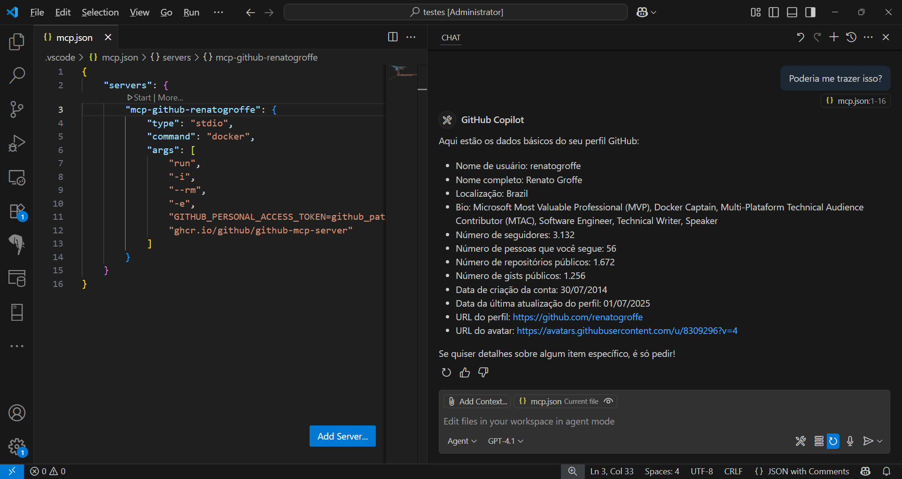

# github-mcp-vscode-2025-07
Instruções para testes com o servidor MCP do GitHub (a partir de uma imagem Docker) no Visual Studio Code.

Para configurar o MCP do GitHub selecionar no Visual Studio Code a opção **Command (stdio)**:


Informar como comando a instrução:

```bash
docker run -i --rm -e GITHUB_PERSONAL_ACCESS_TOKEN=github_pat_token ghcr.io/github/github-mcp-server
```

Como indicado na imagem a seguir:


Para os testes aqui descritos utilizei **Workspace Settings** (ao invés de uma configuração global com **User Settings**):


Um arquivo de nome **mcp.json** será gerado na pasta **.vscode** do diretório-base a partir do qual abrimos o Visual Studio Code:

```json
{
    "servers": {
        "mcp-github-renatogroffe": {
            "type": "stdio",
            "command": "docker",
            "args": [
                "run",
                "-i",
                "--rm",
                "-e",
                "GITHUB_PERSONAL_ACCESS_TOKEN=github_pat_token",
                "ghcr.io/github/github-mcp-server"
            ]
        }
    }
}
```

Um exemplo de uso do MCP do GitHub com minha conta (**renatogroffe**):


Já na próxima imagem temos um segundo exemplo:


